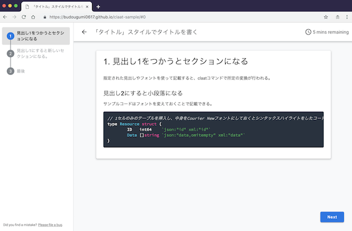

claat-sample
====

以下のGoogle Docから作成したCodelabのページをGitHub Pagesで公開するサンプル

https://docs.google.com/document/d/17d7hzKZVbiAvEQ882ozn19DI6Sy-DWbXLJnv_EgK5xY/edit?usp=sharing

# ページの作成方法

```bash
$ claat export 17d7hzKZVbiAvEQ882ozn19DI6Sy-DWbXLJnv_EgK5xY
$ ls claat-sample
codelab.json img          index.html
$ claat serve
```

# ページの確認

https://budougumi0617.github.io/claat-sample/


